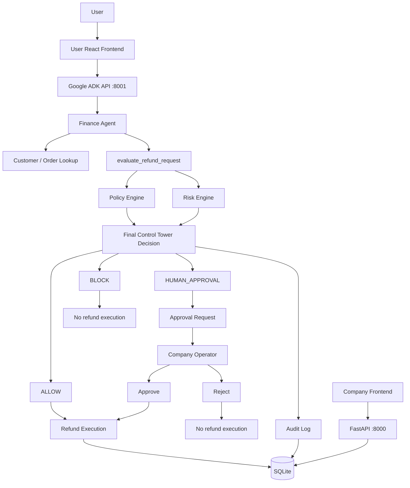

# AgentOps Control Tower — Architecture

This document describes the currently implemented system structure and execution flow. It intentionally focuses on verified behavior rather than planned future features.

## System Overview

AgentOps Control Tower places a deterministic refund-governance layer between an LLM-based Finance Agent and refund execution.

The active agent is:

```text
app/finance_agent/agent.py
```

The active Finance Agent uses Gemini `gemini-3.5-flash-lite` and exposes two tools:

```text
get_customer_order
evaluate_refund_request
```

The agent is instructed to use the Control Tower for refund governance and not make or override the refund decision itself.

## High-Level Architecture



## Component Responsibilities

### Finance Agent

File:

```text
app/finance_agent/agent.py
```

Responsibilities:

- Interpret the user's refund request.
- Identify the customer ID and requested refund amount.
- Call `get_customer_order`.
- Call `evaluate_refund_request`.
- Report the decision returned by the Control Tower.

The agent is explicitly instructed not to execute refunds or make/override refund decisions.

### Customer / Order Lookup

File:

```text
app/tools/lookup_tool.py
```

The lookup tool queries the SQLite database for the customer and the first order associated with that customer.

Its confirmed return shape is:

```json
{
  "success": true,
  "customer": {
    "id": 101,
    "name": "Rahul Sharma",
    "email": "rahul@example.com",
    "status": "active"
  },
  "order": {
    "id": 1001,
    "customer_id": 101,
    "amount": 5000.0,
    "status": "delivered"
  }
}
```

When a customer or order is not found, the tool returns a `success: false` result with an error message.

### Control Tower

File:

```text
app/control_tower/control_tower.py
```

The Control Tower:

1. Evaluates the refund policy.
2. Calculates refund risk.
3. Derives the final decision.
4. Executes, creates an approval request, or blocks the action.
5. Writes the decision to `audit_logs`.

The implemented decision precedence is:

```text
Start with policy decision

HIGH risk
    -> BLOCK

MEDIUM risk + policy ALLOW
    -> HUMAN_APPROVAL

Otherwise
    -> keep policy decision
```

## Decision Outcomes

### ALLOW

```text
Control Tower
    -> execute_refund_through_gateway()
    -> refund_tool.execute_refund()
    -> Refund(status="processed")
    -> AuditLog
```

The refund tool stores a processed refund record and returns:

```json
{
  "success": true,
  "refund_id": 1,
  "customer_id": 101,
  "order_id": 1001,
  "amount": 5000.0,
  "status": "processed",
  "reason": "Wrong product"
}
```

### HUMAN_APPROVAL

```text
Control Tower
    -> create_approval_request()
    -> ApprovalRequest(status="pending")
    -> Company operator
```

Approval behavior:

```text
pending
  |
  +--> approved -> refund execution -> approval status approved
  |
  +--> rejected -> approval status rejected
```

### BLOCK

```text
Control Tower
    -> execution.status = "blocked"
    -> no refund execution
```

The Control Tower still records the decision in the audit log.

## Available Tools

### `get_customer_order`

Input:

```text
customer_id: int
```

Output:

- `success`
- customer information
- order information

or an error response if the customer/order cannot be found.

### `evaluate_refund_request`

Inputs:

```text
customer_id: int
order_id: int
refund_amount: float
order_amount: float
reason: str
```

Output includes:

```text
customer_id
order_id
refund_amount
order_amount
reason
decision
policy_decision
policy_reason
risk
execution
```

For `HUMAN_APPROVAL`, an additional `approval` object is returned.

For `ALLOW`, the `execution` object contains the refund execution result.

For `BLOCK`, `execution.executed` is false and the execution status is `blocked`.

### Refund gateway

File:

```text
app/tools/tool_gateway.py
```

The gateway validates:

- refund amount must be greater than zero;
- customer ID must be greater than zero;
- order ID must be greater than zero.

It then delegates to `execute_refund`.

The gateway itself does not make the policy decision.

## Agent Execution Flow

```text
1. User writes refund request
2. Finance Agent receives request
3. Finance Agent calls get_customer_order
4. Finance Agent calls evaluate_refund_request
5. Control Tower evaluates policy
6. Control Tower calculates risk
7. Control Tower derives final decision
8. ALLOW -> execute refund
   HUMAN_APPROVAL -> create approval
   BLOCK -> do not execute
9. Control Tower records audit log
10. Finance Agent reports the result
```

The user frontend communicates with the ADK `/run` endpoint and renders the returned decision as a UI card.

## FastAPI Backend

The FastAPI application is:

```text
app/main.py
```

It currently registers:

```text
/audit
/approvals
/refunds
```

and exposes the root health-style response:

```http
GET /
```

The company frontend communicates with:

```text
http://127.0.0.1:8000
```

The current CORS configuration allows the company frontend origin:

```text
http://localhost:5173
```

## Company Dashboard

The company frontend is under:

```text
frontend/
```

Its current API integration uses the FastAPI backend for:

- audit logs;
- pending approvals;
- approval actions;
- refund request submission.

The company UI is therefore the operator side of the workflow rather than the LLM agent itself.

## User-Facing Finance Agent Interface

The user frontend is under:

```text
user_frontend/
```

It runs on:

```text
http://localhost:5174
```

It communicates directly with the ADK API:

```text
http://127.0.0.1:8001/run
```

The current frontend supports:

- Finance Agent chat;
- session-based requests;
- `ALLOW` decision cards;
- `HUMAN_APPROVAL` decision cards;
- `BLOCK` decision cards;
- formatted agent responses;
- loading state;
- error state.

## Frontend / Backend Communication

Company frontend:

```text
React
  -> Axios
  -> FastAPI :8000
```

User frontend:

```text
React
  -> Fetch
  -> ADK :8001
```

The user frontend currently sends the ADK request with:

```json
{
  "appName": "finance_agent",
  "userId": "user-1",
  "sessionId": "<session id>",
  "newMessage": {
    "role": "user",
    "parts": [
      {
        "text": "<user message>"
      }
    ]
  },
  "streaming": false
}
```

The payload shape above is the current client-side request used by the project.

## Database Design

The application uses:

```text
SQLite
```

with:

```text
agentops.db
```

The SQLAlchemy models are:

```text
Customer
Order
Refund
ApprovalRequest
AuditLog
```

Relationships currently defined by foreign keys:

```text
Customer
  |
  +--> Order
  |
  +--> Refund
  |
  +--> ApprovalRequest
  |
  +--> AuditLog

Order
  |
  +--> Refund
  |
  +--> ApprovalRequest
  |
  +--> AuditLog
```

Current baseline seed data:

```text
Customer 101 -> Order 1001 -> ₹5,000
Customer 102 -> Order 1002 -> ₹25,000
Customer 103 -> Order 1003 -> ₹3,000
```

## Audit Logging

Every call to `evaluate_refund_request` attempts to create an audit record containing:

```text
customer_id
order_id
refund_amount
decision
reason
```

The stored reason contains the policy reason and risk level/score.

One current implementation detail is important: if audit-log persistence raises an exception, the Control Tower rolls back the audit transaction but does not propagate that audit failure to the caller. The decision result can therefore still be returned without a successfully persisted audit record.

## Error Handling

The tool layer uses exception handling and database rollback.

Examples:

- refund execution failures return `success: false`;
- missing approval requests return an error;
- non-pending approval requests are rejected;
- invalid approval decisions are rejected;
- invalid refund gateway inputs raise validation errors.

This is local application error handling, not a complete production error-management or observability system.

## Test Isolation

`conftest.py` provides a separate temporary SQLite database for pytest.

```text
Real application
    -> agentops.db

pytest
    -> temporary SQLite database
```

This prevents automated tests from populating the real local database with refund, approval, and audit records.

## Current Technical Limitations

- The system is local-development focused.
- SQLite is used for persistence.
- There is no authentication/authorization layer in the current FastAPI application.
- Refund execution writes a processed record to SQLite; it is not a real payment-provider integration.
- The system contains one active Finance Agent.
- There is no deployed cloud runtime documented here.
- The policy/risk engines are small, project-specific control components rather than a complete enterprise policy framework.
- The exact full implementation of the policy and risk modules was not included in the source files available for this documentation review; the documented rules and scenarios are therefore limited to the verified project context and observed tests/results.
